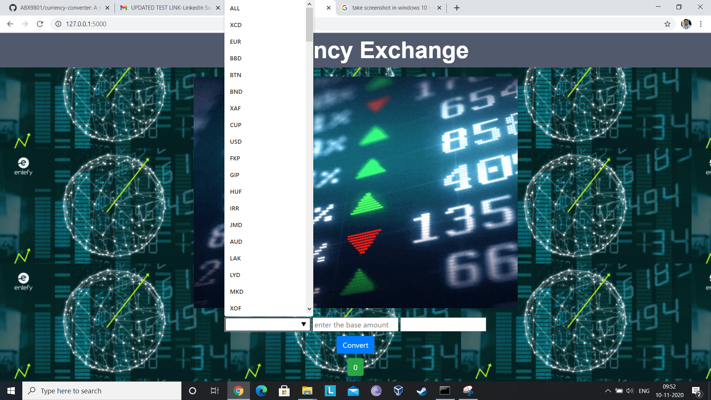

# currency-converter
A simple web-app. Made with flask also using REST api and Postgres sql.

# How to run the app
- download and install python, add python to path
- set up postgres sql on your pc
- create a database using pgadmin
- replace all the database url in the code to your database url
- execute in order
```shell
python model.py
python create.py
python import.py
```
- advance to application directory
```shell
pip install flask
pip install SQLAlchemy
pip install psycopg2
pip install Flask-Session
```
- run the localhost server
```shell
flask run
```
- You will get a link in bash or cmd like http://127.0.0.1:5000/
- The website will run on this link

# Website Screenshots


